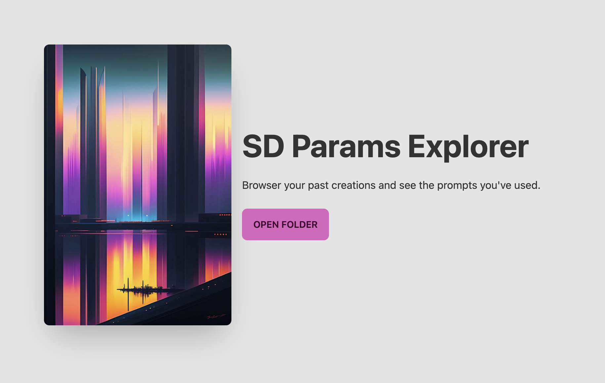

# SD Param Explorer

Web app to explore parameters used for Stable-Diffusion generated images. Under the hood this tool reads the exif data in image files and extracts the information from there.

Contributions welcome 😁




## Contributing

Contributions are super welcome. Be it code improvements, UI suggestions or anything else.

### Guiding principles

In every software project the question "what to focus on" arises on a daily basis. To help us in this question, we postulate a few guiding principles.

1. We value polished and "juicy" features that make users happy over the amount of available features.
2. When introducing new features we value thought through processes including reafactoring that make the application coherrent over adding a feature fast.
3. To support the above we value "re-factorable" code over architectures that try to take all possible future cases into consideration.
4. We value features in the hand of our users over fully polished features.

### Development

First, run the development server:

```bash
npm run dev
```

Open [http://localhost:3000](http://localhost:3000) with your browser to see the result.

### Tech stack

- [NextJS 13](https://beta.nextjs.org/docs) a [React](https://reactjs.org/) based fullstack framework.
- [Vercel](https://vercel.com/) for hosting.
- [Tailwind CSS](https://tailwindcss.com/) for styling
- [Daisy UI](https://daisyui.com/) component library based on Tailwind.
- [ExifReader](https://github.com/mattiasw/ExifReader) to parse Exif data and read parameters from tEXt.
